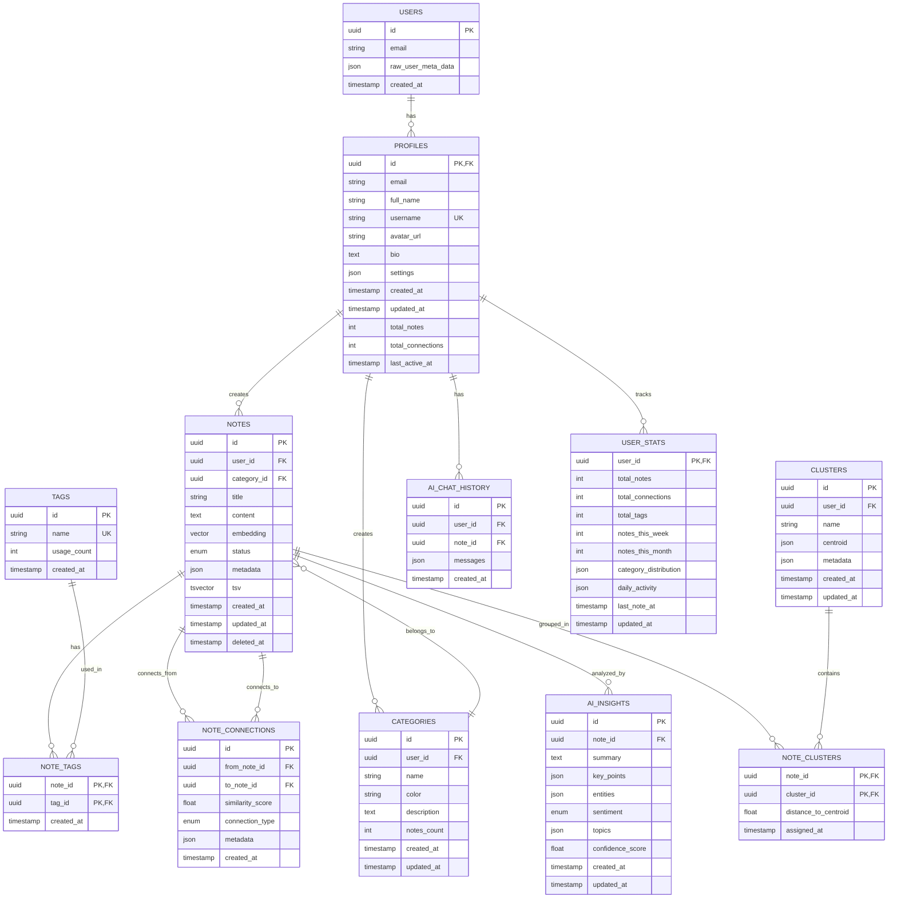

# Database Schema Documentation

## Entity Relationship Diagram



## 📊 Table Descriptions

### Core Tables

#### `profiles`
User profile information extending Supabase auth.
```sql
CREATE TABLE profiles (
    id UUID PRIMARY KEY REFERENCES auth.users(id),
    email TEXT UNIQUE NOT NULL,
    full_name TEXT,
    username TEXT UNIQUE,
    avatar_url TEXT,
    bio TEXT,
    settings JSONB DEFAULT '{}',
    created_at TIMESTAMPTZ DEFAULT NOW(),
    updated_at TIMESTAMPTZ DEFAULT NOW()
);
```

#### `notes`
Core content storage with vector embeddings.
```sql
CREATE TABLE notes (
    id UUID PRIMARY KEY DEFAULT uuid_generate_v4(),
    user_id UUID NOT NULL REFERENCES profiles(id),
    category_id UUID REFERENCES categories(id),
    title TEXT,
    content TEXT NOT NULL,
    embedding vector(1536), -- OpenAI embeddings
    status note_status DEFAULT 'active',
    metadata JSONB DEFAULT '{}',
    tsv tsvector GENERATED ALWAYS AS (
        to_tsvector('english', coalesce(title, '') || ' ' || content)
    ) STORED,
    created_at TIMESTAMPTZ DEFAULT NOW(),
    updated_at TIMESTAMPTZ DEFAULT NOW(),
    deleted_at TIMESTAMPTZ
);
```

#### `categories`
User-defined categories for organizing notes.
```sql
CREATE TABLE categories (
    id UUID PRIMARY KEY DEFAULT uuid_generate_v4(),
    user_id UUID NOT NULL REFERENCES profiles(id),
    name TEXT NOT NULL,
    color TEXT DEFAULT '#6B7280',
    description TEXT,
    notes_count INTEGER DEFAULT 0,
    created_at TIMESTAMPTZ DEFAULT NOW(),
    updated_at TIMESTAMPTZ DEFAULT NOW(),
    UNIQUE(user_id, name)
);
```

#### `tags`
Global tag repository with usage tracking.
```sql
CREATE TABLE tags (
    id UUID PRIMARY KEY DEFAULT uuid_generate_v4(),
    name TEXT UNIQUE NOT NULL,
    usage_count INTEGER DEFAULT 0,
    created_at TIMESTAMPTZ DEFAULT NOW()
);
```

### Relationship Tables

#### `note_connections`
Knowledge graph connections between notes.
```sql
CREATE TABLE note_connections (
    id UUID PRIMARY KEY DEFAULT uuid_generate_v4(),
    from_note_id UUID NOT NULL REFERENCES notes(id),
    to_note_id UUID NOT NULL REFERENCES notes(id),
    similarity_score FLOAT NOT NULL CHECK (similarity_score >= 0 AND similarity_score <= 1),
    connection_type connection_type DEFAULT 'similar',
    metadata JSONB DEFAULT '{}',
    created_at TIMESTAMPTZ DEFAULT NOW(),
    UNIQUE(from_note_id, to_note_id)
);
```

### AI Tables

#### `ai_insights`
AI-generated insights for each note.
```sql
CREATE TABLE ai_insights (
    id UUID PRIMARY KEY DEFAULT uuid_generate_v4(),
    note_id UUID UNIQUE NOT NULL REFERENCES notes(id),
    summary TEXT,
    key_points JSONB DEFAULT '[]',
    entities JSONB DEFAULT '[]',
    sentiment sentiment_type,
    topics JSONB DEFAULT '[]',
    confidence_score FLOAT,
    created_at TIMESTAMPTZ DEFAULT NOW(),
    updated_at TIMESTAMPTZ DEFAULT NOW()
);
```

#### `ai_processing_queue`
Queue for asynchronous AI processing.
```sql
CREATE TABLE ai_processing_queue (
    id UUID PRIMARY KEY DEFAULT uuid_generate_v4(),
    note_id UUID NOT NULL REFERENCES notes(id),
    processing_type TEXT NOT NULL,
    status processing_status DEFAULT 'pending',
    priority INTEGER DEFAULT 5,
    attempts INTEGER DEFAULT 0,
    error_message TEXT,
    scheduled_at TIMESTAMPTZ DEFAULT NOW(),
    started_at TIMESTAMPTZ,
    completed_at TIMESTAMPTZ,
    created_at TIMESTAMPTZ DEFAULT NOW()
);
```

## 🔍 Indexes

### Performance Indexes
```sql
-- Full text search
CREATE INDEX idx_notes_tsv ON notes USING GIN (tsv);

-- Vector similarity search
CREATE INDEX idx_notes_embedding ON notes USING ivfflat (embedding vector_cosine_ops);

-- Foreign key lookups
CREATE INDEX idx_notes_user_id ON notes(user_id);
CREATE INDEX idx_notes_category_id ON notes(category_id);
CREATE INDEX idx_note_connections_from ON note_connections(from_note_id);
CREATE INDEX idx_note_connections_to ON note_connections(to_note_id);

-- Timestamp queries
CREATE INDEX idx_notes_created_at ON notes(created_at DESC);
CREATE INDEX idx_notes_updated_at ON notes(updated_at DESC);
```

## 🛡️ Row Level Security (RLS)

### Notes RLS
```sql
-- Users can only see their own notes
CREATE POLICY "Users can view own notes" ON notes
    FOR SELECT USING (auth.uid() = user_id);

-- Users can only create notes for themselves
CREATE POLICY "Users can create own notes" ON notes
    FOR INSERT WITH CHECK (auth.uid() = user_id);

-- Users can only update their own notes
CREATE POLICY "Users can update own notes" ON notes
    FOR UPDATE USING (auth.uid() = user_id);

-- Users can only delete their own notes
CREATE POLICY "Users can delete own notes" ON notes
    FOR DELETE USING (auth.uid() = user_id);
```

## 🔄 Triggers

### Auto-update timestamps
```sql
CREATE OR REPLACE FUNCTION update_updated_at()
RETURNS TRIGGER AS $$
BEGIN
    NEW.updated_at = NOW();
    RETURN NEW;
END;
$$ LANGUAGE plpgsql;

CREATE TRIGGER update_notes_updated_at
    BEFORE UPDATE ON notes
    FOR EACH ROW
    EXECUTE FUNCTION update_updated_at();
```

### Update statistics
```sql
CREATE OR REPLACE FUNCTION update_user_stats()
RETURNS TRIGGER AS $$
BEGIN
    -- Update user stats on note changes
    UPDATE user_stats
    SET 
        total_notes = (SELECT COUNT(*) FROM notes WHERE user_id = NEW.user_id),
        last_note_at = NOW(),
        updated_at = NOW()
    WHERE user_id = NEW.user_id;
    
    RETURN NEW;
END;
$$ LANGUAGE plpgsql;
```

## 📈 Views

### User Dashboard View
```sql
CREATE VIEW user_dashboard AS
SELECT 
    p.id,
    p.email,
    p.full_name,
    COUNT(DISTINCT n.id) as total_notes,
    COUNT(DISTINCT nc.id) as total_connections,
    COUNT(DISTINCT t.id) as total_tags,
    MAX(n.created_at) as last_note_at
FROM profiles p
LEFT JOIN notes n ON p.id = n.user_id
LEFT JOIN note_connections nc ON n.id = nc.from_note_id
LEFT JOIN note_tags nt ON n.id = nt.note_id
LEFT JOIN tags t ON nt.tag_id = t.id
GROUP BY p.id;
```

## 🔐 Security Considerations

1. **Data Isolation**: RLS ensures users only access their own data
2. **Soft Deletes**: Notes have `deleted_at` for recovery
3. **Audit Trail**: All tables have timestamp tracking
4. **Input Validation**: Check constraints on data integrity
5. **Index Security**: No indexes on sensitive data

## 🚀 Performance Optimizations

1. **Vector Search**: IVFFlat index for fast similarity search
2. **Full Text Search**: GIN index with tsvector
3. **Partitioning**: Ready for date-based partitioning
4. **Connection Pooling**: Configured in Supabase
5. **Query Optimization**: Materialized views for complex queries

## 📊 Data Types

### Custom Enums
```sql
CREATE TYPE note_status AS ENUM ('active', 'archived', 'deleted');
CREATE TYPE connection_type AS ENUM ('similar', 'reference', 'continuation', 'contradiction');
CREATE TYPE sentiment_type AS ENUM ('positive', 'neutral', 'negative', 'mixed');
CREATE TYPE processing_status AS ENUM ('pending', 'processing', 'completed', 'failed');
```

### JSON Schema Examples

#### Note Metadata
```json
{
  "source": "quick_capture",
  "device": "mobile",
  "location": "optional",
  "weather": "optional",
  "mood": "optional"
}
```

#### AI Insights
```json
{
  "key_points": [
    "Important point 1",
    "Important point 2"
  ],
  "entities": [
    {
      "type": "person",
      "value": "John Doe",
      "confidence": 0.95
    }
  ],
  "topics": [
    {
      "name": "machine learning",
      "relevance": 0.85
    }
  ]
}
```